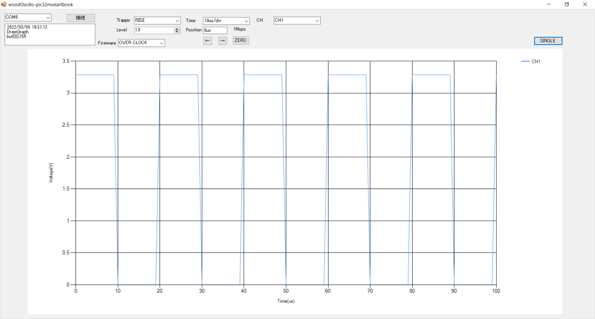

# woodOscillo-PC
自作オシロwoodOscilloのPC側プログラムでWindows向けソフトウェア  

2Msps4chのUSBオシロで現状はシングルのみで本当に簡易的なソフトです。

  

# 使い方 
OscilloKun.exeを実行するか自分でコンパイルする。  

ソフトウェア  
- ポートを選択し接続ボタンを押す
- オシロ的いろいろを設定
- Singleボタンを押す
- トリガーが掛かれば表示されるはず

# 開発情報  
IDEはVisual Studio2019でwindowsフォームアプリケーションで開発してます。